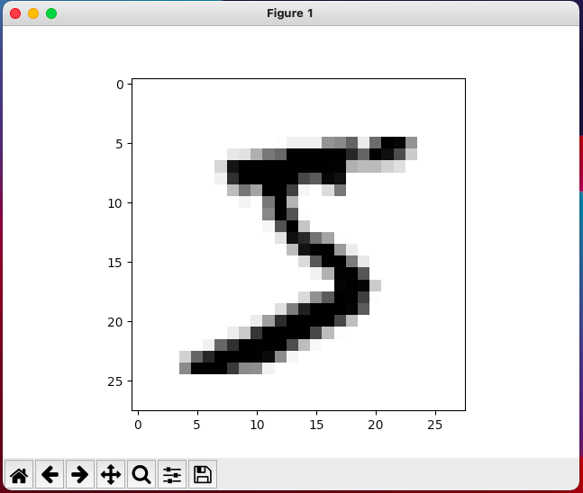
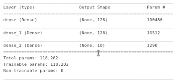
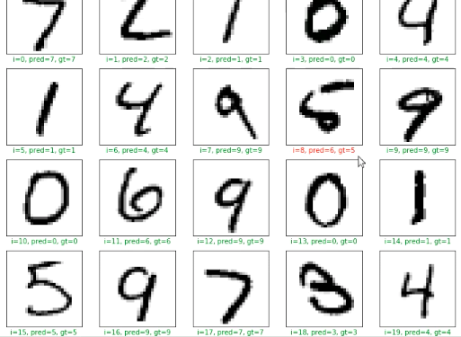
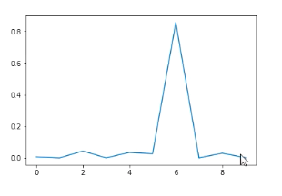

# Image-Classification-Handwritten-Letters-Tensorflow-Keras
A Neural Network is constructed, using TensorFlow and Keras, to classify handwritten letters and predict the corresponding output class using the MNIST dataset

# Example

A neural network was created, trained and evaluateda using Tensorflow and Keras. 

Dataset of handwritten layers used : MNIST

Sample handwritten letter:

An overview of the layers of the constructed network and sample plots are shown:

The accuracy of prediction of a handwritten letter ''6'' is depicted in the following plot:

